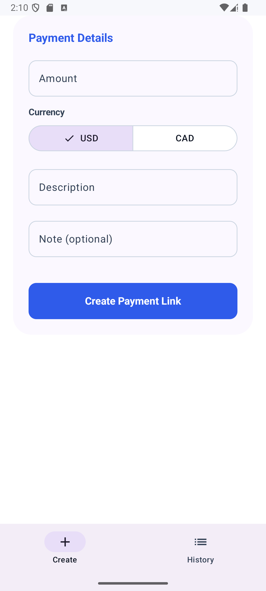
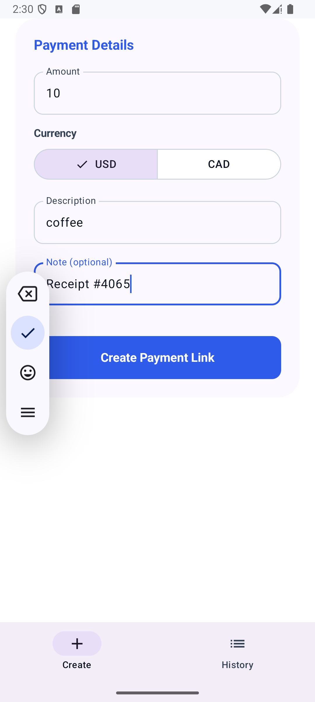
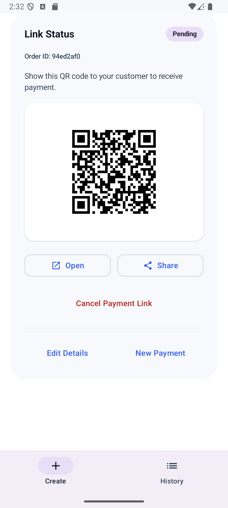
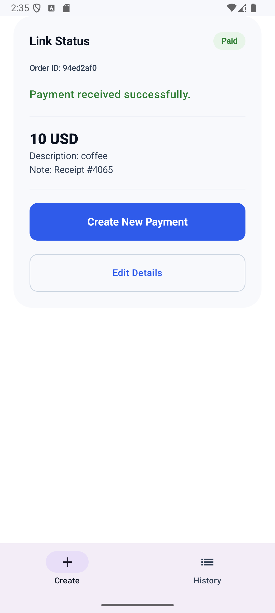
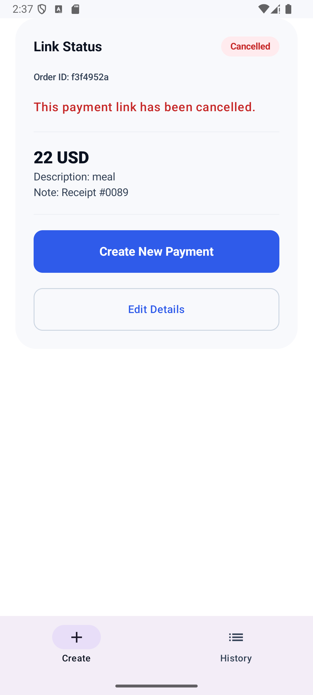
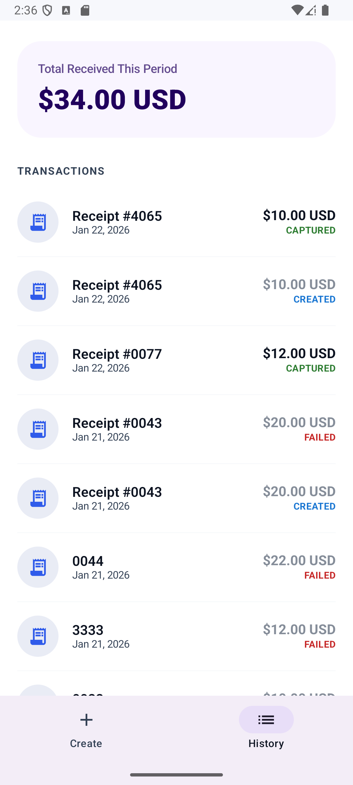

# QuickPay  
Android + Ktor Full-Stack Payments Demo

QuickPay is a full-stack fintech demo that models real-world payment link workflows similar to Stripe and Finix.  
It showcases how a modern Android app and a Kotlin backend work together to create payment links, manage their lifecycle, and handle webhook-driven payment events.

This project is designed to be portfolio-grade, focusing on realistic payment states, backend correctness, and a clean merchant-style UI.

---

## Key Highlights

- End-to-end payment link creation
- QR-based checkout flow
- Webhook-driven payment state transitions
- Cancel payment functionality
- Terminal vs active payment states
- Transaction history with Toronto timezone timestamps
- Clean fintech-style UI with status badges and cards

---

## Screenshots

> Screenshots are organized in the `screenshots/` directory.

### Create Payment
<p>
  
  
</p>

### Active Payment Link (Pending)
<p>
  
</p>

### Payment Successful
<p>
  
</p>

### Cancelled Payment
<p>
  
</p>

### Payment History
<p>
  
</p>

---

## Features

### Payment Link Creation
- Merchant enters amount, currency, description, and optional note
- Backend creates a hosted payment link and order record
- QR code is generated for in-person or remote checkout

### QR-Based Checkout
- Customer completes payment via hosted checkout page
- Android app never handles sensitive payment data

### Webhook-Driven State Management
- Backend processes payment provider webhooks
- Order states updated authoritatively on the server
- Android reflects backend state via polling

Supported states:
- CREATED
- PENDING
- CAPTURED
- FAILED
- CANCELLED

### Cancel Payment Flow
- Merchant can cancel active payment links
- Cancelled payments are terminal and immutable

### Transaction History
- Chronological list of recent transactions
- Status badges (Created, Captured, Failed, Cancelled)
- Amount, receipt reference, and timestamp (America/Toronto)

---

## Tech Stack

### Android
- Kotlin
- Jetpack Compose (Material 3)
- MVVM architecture
- ViewModel + StateFlow
- Retrofit + Moshi
- Navigation Component
- Chrome Custom Tabs

### Backend
- Kotlin
- Ktor
- PostgreSQL
- Exposed ORM
- Flyway migrations
- REST APIs
- Webhook ingestion and processing

---

## Architecture Overview

```
Android App
   |
   | REST APIs
   v
Ktor Backend
   |
   | Webhooks
   v
Payment Provider
```

### Design Principles
- Backend is the single source of truth
- Webhooks drive all final payment outcomes
- Terminal states are immutable
- UI reflects backend state only

---

## API Overview

| Method | Endpoint | Description |
|------|--------|------------|
| POST | /v1/links | Create payment link |
| GET | /v1/orders/{id} | Fetch order status |
| GET | /v1/orders | List recent orders |
| POST | /v1/links/{id}/cancel | Cancel payment link |
| POST | /v1/webhooks | Receive payment provider webhooks |

---

## Running the Project

### Backend
```bash
cd backend
./gradlew run
```

Server runs at:
```
http://127.0.0.1:8080
```

### Android
- Open `android/` in Android Studio
- Use emulator base URL:
```
http://10.0.2.2:8080
```

---

## Project Status

QuickPay is an actively evolving fintech demo intended for portfolio and recruiter review.  
It emphasizes realistic payment modeling, backend reliability, and clean Android architecture.

---

## Roadmap

- Webhook signature verification
- Background reconciliation jobs
- Merchant analytics dashboard
- Improved logging and observability
